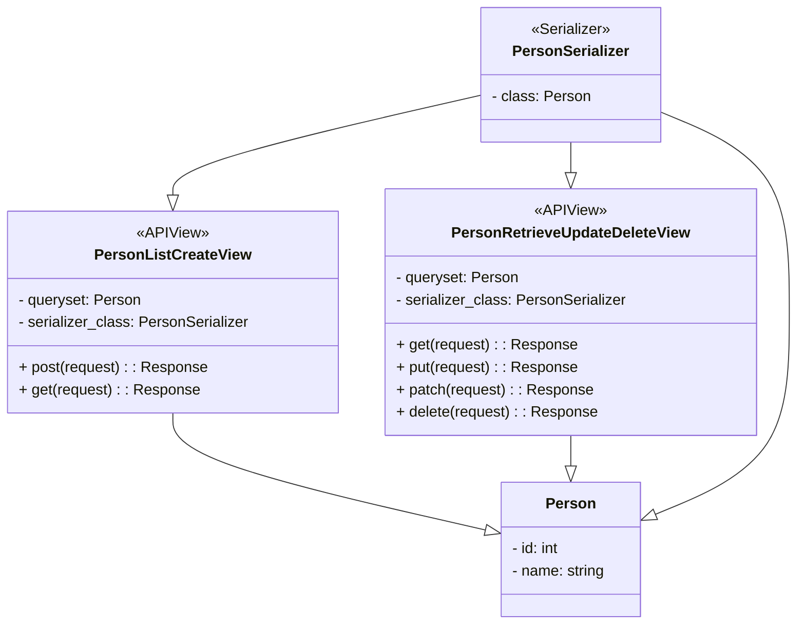

# hng_stage_two
# Person REST API Documentation

This is a simple REST API for managing person records. It allows you to perform CRUD operations on persons.

## UML DIAGRAM


## Endpoints

### Create a Person
- **Endpoint:** `POST /api`
- **Request Format:**
  ```json
  {
      "name": "Kenechukwu Akubue"
  }
  ```
- **Response Format (Success):**
  ```json
  {
    "id": 1,
    "name": "Kenechukwu Akubue"
  }
  ```

### Retrieve a Person
- **Endpoint:** `GET /api/{id}/`
- **Response Format (Success):**
  ```json
  {
    "id": 2,
    "name": "HNG YOU MUST GIVE ME A JOB"
  }
  ```

### Update a Person
- **Endpoint:** `PUT /api/{id}/`
- **Request Format:**
  ```json
  {
    "name": "Mark You Owe Me"
  }
  ```
- **Response Format (Success):**
  ```json
  {
    "id": 1,
    "name": "Mark You Owe Me"
  }
  ```

### Delete a Person
- **Endpoint:** `DELETE /api/{id}/`
- **Response Format (Success):**
  ```json
  {
    "message": "Person with id 1 has been deleted successfully."
  }
  ```

## Sample Usage
### Creating a Person
```bash
# for local
curl -X POST -H "Content-Type: application/json" -d '{"name": "Kenechukwu Akubue"}' http://localhost:8000/api/
# for online
curl -X POST -H "Content-Type: application/json" -d '{"name": "Kenechukwu Akubue"}' https://hng.pythonanywhere.com/api/
```

### Retrieving a Person
```bash
# for local
curl http://localhost:8000/api/1/
# for online
curl https://hng.pythonanywhere.com/api/1/
```

### Updating a Person
```bash
# for local
curl -X PUT -H "Content-Type: application/json" -d '{"name": "Mark Cuban"}' http://localhost:8000/api/1/
# for online
curl -X PUT -H "Content-Type: application/json" -d '{"name": "Mark Cuban"}' https://hng.pythonanywhere.com/api/1/
```

### Deleting a Person
```bash
# for local
curl -X DELETE http://localhost:8000/api/1/
# for online
curl -X DELETE https://hng.pythonanywhere.com/api/1/
```

## Known Limitations and Assumptions
- This API assumes that "name" is a required field for creating and updating a person.
- Validation is done for the "name" field to ensure it contains no integers.

## Setting Up and Deploying Locally
**Clone the repository:**
```bash
git clone https://github.com/kengoon/hng_stage_two.git
```
**Install dependencies:**
```bash
pip install -r requirements.txt
```
**Apply migrations:**
```bash
python manage.py migrate
```
**Start the development server:**
```bash
python manage.py runserver
```

## Testing
Sharable link to postman testable script
```url
https://api.postman.com/collections/25242424-2457cfde-dc89-4be8-9ff4-e633aa1f03ea?access_key=PMAT-01HA2HCVE6NG9VBD45S28GYHS5
```
